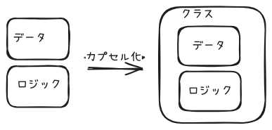

## カプセル化 ― データとロジックを閉じ込める

> 🎮 **身近なたとえ:** ゲームのコントローラーを思い浮かべてください。
> ボタンを押せば技が出る。でも、コントローラーの中の基盤（データ）を直接触ることはできません。
> これが「カプセル化」です。中身を隠して、決められた操作だけを許可する仕組みです。



**Java:**
```java
// データがむき出しで、誰でも自由に書き換えられてしまう状態
int hitPoint = 100;

// どこかの処理でダメージを受ける
hitPoint = hitPoint - 30;
if (hitPoint < 0) {
    hitPoint = 0; // 0未満になったら0にする
}

// ... 別の場所のコード ...

// 誰かが間違えて不正な値を代入してしまってもコンパイラは止めてくれない！
hitPoint = -500;  // ← ルール違反だがエラーにならない
hitPoint = 99999; // ← HPの上限を超えているがエラーにならない
```

**Python:**
```python
# データがむき出しで、誰でも自由に書き換えられてしまう状態
hit_point: int = 100

# どこかの処理でダメージを受ける
hit_point = hit_point - 30
if hit_point < 0:
    hit_point = 0

# ... 別の場所のコード ...

# 誰かが間違えて不正な値を代入してしまっても何もエラーが出ない！
hit_point = -500
hit_point = 99999
```

**TypeScript:**
```typescript
// データがむき出しで、誰でも自由に書き換えられてしまう状態
let hitPoint: number = 100;

// どこかの処理でダメージを受ける
hitPoint = hitPoint - 30;
if (hitPoint < 0) {
    hitPoint = 0;
}

// ... 別の場所のコード ...

// 誰かが間違えて不正な値を代入してしまっても何もエラーが出ない！
hitPoint = -500;
hitPoint = 99999;
```

---

### 🚨 何がダメなのか？ (データむき出しの問題点)

> 💡 **用語: カプセル化（Encapsulation）とは？**
> データ（変数）と、そのデータを操作するロジック（メソッド）を **1つのクラスにまとめ** 、外部からデータを直接触れないように隠蔽すること。
> 風邪薬の「カプセル」のように、中の薬（データ）を包み込んで、外から中身を直接いじれないようにするイメージ。

<br>

#### 1. 🔴 不正な値の混入をシステム的に防げない
> 対象: `hitPoint = -500;` などの自由な代入

| 名前 | 問題 |
|---|---|
| `int hitPoint`（生のデータ） | 単なる `int` 型なので、 **「-9999」や「10億」というゲーム上あり得ない数値でも、エラーにならずに受け入れてしまう** 。データに「ルール（0〜999）」を持たせる手段がない。 |

<br>

#### 2. 🔴 ルールを守る `if` 文があちこちにコピペされる
> 対象: `if (hitPoint < 0) { hitPoint = 0; }`

| 名前 | 問題 |
|---|---|
| バリデーション処理 | 「HPは0未満にならない」「HPは最大値を超えない」といったルールを守るための `if` 文が、ダメージを受ける箇所・回復する箇所の **すべてにコピペされる** ことになる。1箇所でも書き忘れたらバグになる。 |

---

### 🌟 改善版コード（データとルールをクラスに閉じ込める）

> 💡 **用語: 完全コンストラクタ（Complete Constructor）とは？**
> オブジェクトを生成する時点（コンストラクタ）で、必要なデータの **全チェックを完了させる** 設計パターン。生成された後のオブジェクトは「100%正しい状態」であることが保証される。

**一言でいうと:** HPを「ただの数値」ではなく **「HPの専用クラス」** にして、ルール（0〜999）やダメージ・回復処理をそのクラスの中に閉じ込める。外部からは決められた操作（メソッド）しかできなくする。

**Java:**
```java
// ✅ カプセル化されたクラス
class HitPoint {
    private static final int MIN = 0;   // HPの最小値
    private static final int MAX = 999;  // HPの最大値
    private final int value; // private + final = 外部から読み書き不可

    // 門番：不正な値でHPオブジェクトを作ろうとしたら、即座にエラーを出す
    HitPoint(final int value) {
        if (value < MIN) throw new IllegalArgumentException("HPは" + MIN + "以上");
        if (MAX < value) throw new IllegalArgumentException("HPは" + MAX + "以下");
        this.value = value;
    }

    // ダメージを受ける処理もクラスの中に閉じ込める
    HitPoint damage(final int amount) {
        final int damaged = Math.max(MIN, this.value - amount);
        return new HitPoint(damaged); // 元のHPは変えず、新しいHPを返す（不変性）
    }

    // 回復処理もクラスの中に閉じ込める
    HitPoint recover(final int amount) {
        final int recovered = Math.min(MAX, this.value + amount);
        return new HitPoint(recovered);
    }

    int getValue() { return value; }
}
```

📝 **使い方:**
```java
HitPoint hp = new HitPoint(100);     // HP100で生成
hp = hp.damage(30);                   // HP70になる
hp = hp.recover(500);                 // HP999（最大値で自動補正）
// HitPoint bad = new HitPoint(-10); // ❌ 即座にエラー！不正なHPは存在できない
```

**Python:**
```python
# ✅ カプセル化されたクラス
class HitPoint:
    MIN: int = 0    # HPの最小値
    MAX: int = 999   # HPの最大値

    def __init__(self, value: int):
        # 門番：不正な値でHPオブジェクトを作ろうとしたら、即座にエラーを出す
        if value < self.MIN:
            raise ValueError(f"HPは{self.MIN}以上")
        if self.MAX < value:
            raise ValueError(f"HPは{self.MAX}以下")
        self._value = value  # _をつけて「外から直接触らないでね」と表現する（Pythonの慣習）

    @property
    def value(self) -> int:
        """読み取り専用。hp.value で値を読めるが、hp.value = 100 とは書けない"""
        return self._value

    def damage(self, amount: int) -> 'HitPoint':
        damaged: int = max(self.MIN, self._value - amount)
        return HitPoint(damaged)

    def recover(self, amount: int) -> 'HitPoint':
        recovered: int = min(self.MAX, self._value + amount)
        return HitPoint(recovered)
```

📝 **使い方:**
```python
hp = HitPoint(100)
hp = hp.damage(30)                    # HP70
hp = hp.recover(500)                  # HP999（最大値で自動補正）
# bad = HitPoint(-10)                # ❌ ValueError! 不正なHPは存在できない
```

**TypeScript:**
```typescript
// ✅ カプセル化されたクラス
class HitPoint {
    private static readonly MIN = 0;
    private static readonly MAX = 999;
    readonly value: number; // readonly = 外部から書き換え不可

    constructor(value: number) {
        if (value < HitPoint.MIN) throw new Error(`HPは${HitPoint.MIN}以上`);
        if (HitPoint.MAX < value) throw new Error(`HPは${HitPoint.MAX}以下`);
        this.value = value;
    }

    damage(amount: number): HitPoint {
        const damaged = Math.max(HitPoint.MIN, this.value - amount);
        return new HitPoint(damaged);
    }

    recover(amount: number): HitPoint {
        const recovered = Math.min(HitPoint.MAX, this.value + amount);
        return new HitPoint(recovered);
    }
}
```

📝 **使い方:**
```typescript
let hp = new HitPoint(100);
hp = hp.damage(30);                   // HP70
hp = hp.recover(500);                 // HP999（最大値で自動補正）
// const bad = new HitPoint(-10);    // ❌ Error! 不正なHPは存在できない
```

<br>

#### ✅ 改善のビフォー・アフター

| 項目 | ❌ 改善前 | ✅ 改善後 | 変わったこと |
|---|---|---|---|
| データの安全性 | `hitPoint = -500;` が通ってしまう | `new HitPoint(-500)` は即座にエラーになる | 不正なHPが **物理的に存在できない** 設計になった |
| ルールの重複 | `if (hp < 0)` をダメージ処理・回復処理の全箇所に書く | `damage()` `recover()` メソッドの中に1箇所だけ書く | ルールの管理が **1クラスに集約** され、書き忘れによるバグが防がれた |
| 変更のしやすさ | 「最大HPを9999に変更」→ コード全体を検索して書き換え | `MAX = 9999` の1箇所を変えるだけ | 仕様変更時の修正漏れが **絶対に起きない** |

---

### 🎯 まとめ（カプセル化における考え方）

#### 1. 目的（Why）
> **「不正なデータがシステムに入り込むのを根絶し、バグを防ぐため」**

* データがむき出しだと、プログラムのどこからでも不正な値を入れられてしまう。
* クラスに閉じ込めれば、 **「門番（コンストラクタ）」** が不正な値を必ず弾いてくれる。

#### 2. 目標（What）
> **「データを持つクラスが、自分のルールを自分で守っている状態」**

* 外部の人が「HPは0以上に保たなきゃ…」と心配する必要がない状態。クラス自身が自己防衛している。

#### 3. 手段（How）
> **「データを private にし、操作は必ずメソッド経由にする」**

| ステップ | ❌ 悪い例 | ⭕️ 良い例 |
|:---:|---|---|
| データの公開 | `public int hp;` | `private final int hp;`（外から触れない） |
| 操作方法 | `hp = hp - 30;`（外部が直接計算） | `hp.damage(30);`（メソッド経由でのみ操作） |

> ※ カプセル化は「面倒な手間」ではなく、 **「将来の自分やチームメンバーをバグから守る保険」** です。
